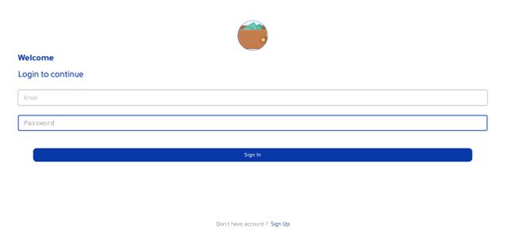
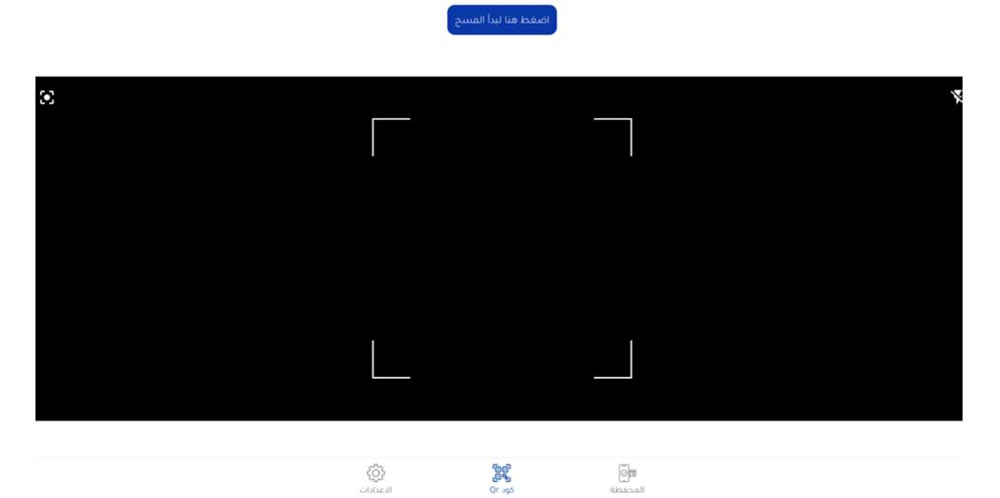

# 📱 Tidopay Mobile Wallet Application – Manual Testing Project

> A comprehensive **Manual Software Testing** project for the **Tidopay Mobile Wallet Application**, focusing on validating authentication, wallet management, QR Code payments, financial transactions, and overall application quality following industry-standard testing practices.

---

# 📌 About The Project

**Tidopay** is a mobile wallet application that enables users to perform secure cashless transactions with merchants using **QR Code** technology. The application allows users to recharge their wallet through **Credit Card** or **Fawry**, make secure payments, manage their balance, and review transaction history.

As a **Manual Software Tester**, I was responsible for ensuring the application's functionality, reliability, usability, and stability by executing comprehensive manual testing activities throughout the project lifecycle.

The testing process included analyzing business requirements, designing test cases, executing functional and regression testing, identifying defects, validating bug fixes, and ensuring that every feature met the expected business requirements before release.

---

# 🎯 Project Objectives

- Validate all core business functionalities.
- Ensure secure financial transactions.
- Verify authentication and authorization processes.
- Test QR Code payment workflow.
- Validate wallet recharge functionality.
- Improve application quality and user experience.
- Identify defects before production release.

---

# 👨‍💻 My Responsibilities

- Analyze Business Requirements and Functional Requirements.
- Design Manual Test Cases.
- Prepare Test Scenarios and Test Data.
- Execute Functional Testing.
- Execute Regression Testing.
- Perform Negative Testing.
- Perform Edge Case Testing.
- Report software defects with detailed documentation.
- Retest resolved defects.
- Collaborate with developers to validate fixes.

---

# 🧪 Features Tested

| Module | Status |
|---------|--------|
| User Registration | ✅ |
| User Login | ✅ |
| OTP Verification | ✅ |
| Wallet Recharge (Credit Card) | ✅ |
| Wallet Recharge (Fawry) | ✅ |
| QR Code Merchant Payment | ✅ |
| Wallet Balance Validation | ✅ |
| Transaction Confirmation | ✅ |
| Transaction History | ✅ |
| Balance Inquiry | ✅ |
| Arabic Language | ✅ |
| English Language | ✅ |

---

# 🔍 Test Scenarios Covered

## 🔐 Authentication

- User Registration
- User Login
- OTP Verification
- Invalid Credentials
- Empty Required Fields
- Password Validation

---

## 💳 Wallet Management

- Recharge Wallet using Credit Card
- Recharge Wallet using Fawry
- Successful Recharge
- Failed Recharge
- Wallet Balance Validation

---

## 📱 QR Code Payments

- QR Code Recognition
- Merchant Payment
- Successful Payment
- Invalid QR Code
- Expired QR Code
- Unreadable QR Code
- Insufficient Wallet Balance
- Payment Confirmation

---

## 📑 Transactions

- Transaction History
- Balance Inquiry
- Successful Transactions
- Failed Transactions

---

## 🌍 Localization

- Arabic Language
- English Language
- UI Validation
- Text Display Verification

---

# 🧪 Testing Types Performed

- ✅ Functional Testing
- ✅ Regression Testing
- ✅ Negative Testing
- ✅ Edge Case Testing
- ✅ Exploratory Testing
- ✅ Usability Testing
- ✅ Mobile Application Testing

---

# 💡 Testing Techniques

- Boundary Value Analysis (BVA)
- Equivalence Partitioning (EP)
- Error Guessing
- Decision Table Testing
- State Transition Testing
- Exploratory Testing

---

# 🐞 Defect Management

All identified issues were documented following ISTQB testing standards, including:

- Steps to Reproduce
- Expected Result
- Actual Result
- Severity
- Priority
- Screenshots (when required)
- Retesting Status

Each resolved issue was validated before closure to ensure application stability.

---

# 📈 Skills Demonstrated

- Manual Testing
- Mobile Application Testing
- Test Case Design
- Test Scenario Design
- Functional Testing
- Regression Testing
- Negative Testing
- Defect Reporting
- Requirements Analysis
- Quality Assurance
- Financial Application Testing
- ISTQB Testing Fundamentals

---

# 📸 Application Screenshots

## 💳 Tidopay Application Logo

The application logo and startup screen were validated to ensure correct branding, proper image rendering, compatibility across different devices, and successful application launch without crashes.

---

## 🔐 Login Functionality

The login screen was manually tested to verify successful authentication using valid credentials, input field validation, error messages for invalid login attempts, usability, and overall user experience.

**Tested Scenarios**

- Successful Login
- Invalid Username/Password
- Empty Fields Validation
- Password Masking
- Input Validation
- Error Messages

---

## 📱 QR Code Payment Feature

The QR Code payment functionality was tested to ensure accurate QR recognition, secure payment execution, correct wallet balance deduction, transaction confirmation, and proper error handling for invalid or unreadable QR codes.

**Tested Scenarios**

- Valid QR Payment
- Invalid QR Code
- Expired QR Code
- Insufficient Wallet Balance
- Payment Confirmation
- Transaction Recording

---

# 🎯 Project Outcomes

Through this project, I gained practical experience in testing a real-world financial mobile application and strengthened my skills in:

- Manual Software Testing
- Mobile Application Testing
- Functional & Regression Testing
- Test Case Design
- Defect Reporting
- Quality Assurance Processes
- Requirements Analysis
- Software Validation & Verification

---

# 👨‍💻 Author

## Muhammed Raafat ElGarf

**Software Testing Engineer**

### GitHub

https://github.com/muhammed-elgarf

### LinkedIn

https://www.linkedin.com/in/muhammed-el-garf-798bb432a/

---

# ⭐ Support

If you found this project useful, please consider giving it a ⭐ on GitHub.

---

## 📄 License

This project is intended for learning, portfolio demonstration, and software testing practice.
